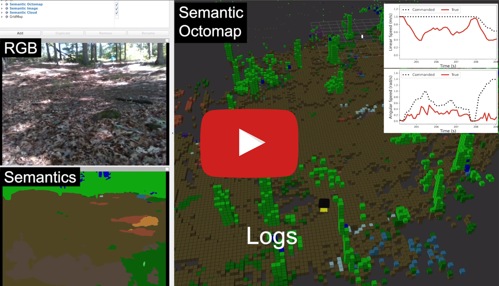
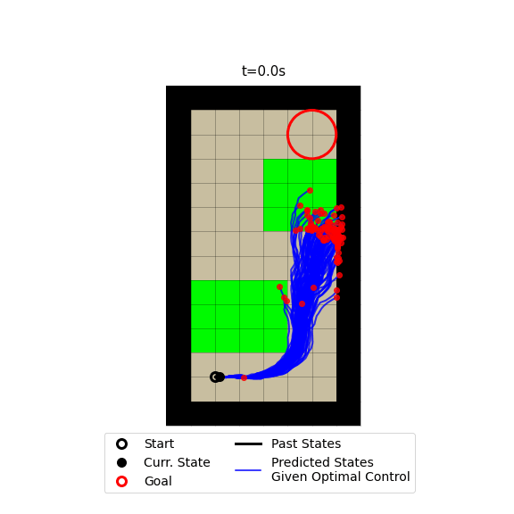
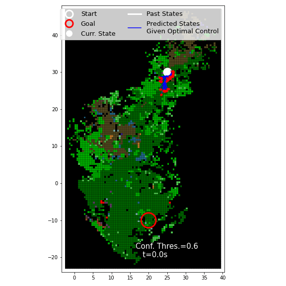

# MPPI_Numba

A GPU implementation of [Model Predictive Path Integral (MPPI) control proposed by Williams et al.](https://ieeexplore.ieee.org/document/7989202) that uses a probabilistic traversability model (proposed in **ADD link to paper**) to plan risk-aware trajectories. The code leverages the Just-in-Time (JIT) compilation offered by [Numba](https://numba.pydata.org/) in Python to parallelize the sampling procedure (both for the control rollouts and the traction maps) on GPU. Although the implementation focuses on the unicycle model whose state consists of the x, y positions and yaw, the code may be adapted for higher dimensional system.

The proposed probabilistic traversability model is represented as a 3D tensor with shape `(num_pmf_bins, height, width)`, where the last two dimensions correspond to the x and y dimensions in real world, and the first dimension contains PMF bins used to approximate the location-dependent parameter distribution. To use the knowledge about the **uncertainty** in traversability, the proposed planners try to reduce the **risk** of obtaining low performance via the following two approaches:
* For a given control sequence, the worst-case expectation of the cost (i.e., the Conditional Value at Risk) is computed over `M` traction map samples, where the worst-case quantile is specified by a hyperparameter.
* The worst-case traction parameters are obtained based on the PMF approximations and used to generate state rollouts from given control sequences. This approach is more efficient, since it simulates the worst-case state realizations instead of directly estimating the worst-case expected objective from samples.

## Video
Please watch the video for an overview of how to learn a probabilitic traversability model that can be used to plan risk-aware trajectories by the code availbale in this repo. Note that the repo only includes the core functionalities for running MPPI with the proposed probabilistic traversability models for a unicycle, due to limited Numba support for object-oriented programming when the code has to be launched as GPU kernels. 

<p align="center">
    <a href="https://youtu.be/GYEb-ww4OTE"></a>
</p>


## Citation
If you find this code useful, please consider citing our papers:
* X. Cai, M. Everett, L. Sharma, P. R. Osteen, and J. P. How, **ADD LINK TO PAPER, ADD ARXIV INFO**

* X. Cai, M. Everett, J. Fink, and J. P. How, “[Risk-Aware Off-Road Navigation via a Learned Speed Distribution Map.](https://arxiv.org/abs/2203.13429?context=cs)” arXiv, Mar. 24, 2022. doi: 10.48550/arXiv.2203.13429.


```bibtex
@article{cai2022probabilistic,
  title={Probabilistic Traversability Model for Risk-Aware Motion Planning in Off-Road Environments},
  author={Cai, Xiaoyi and Everett, Michael and Sharma, Lakshay and Osteen, Philip R and How, Jonathan P},
  eprint={???????????????????????????????????????????????????????????},
  year={2022}
}

@article{cai2022risk,
  title={Risk-Aware Off-Road Navigation via a Learned Speed Distribution Map},
  author={Cai, Xiaoyi and Everett, Michael and Fink, Jonathan and How, Jonathan P},
  eprint={arXiv:2203.13429},
  year={2022}
}
```


## Getting started
The code was only tested on Ubuntu 20.04 with Python 3.8.10.

### Dependencies 
1. Check GPUs supported by Numba and install CUDA toolkit according to [Numba documentation](https://numba.readthedocs.io/en/stable/cuda/overview.html#requirements).
2. Optionally create a python3 virtual environment
```python
python3 -m venv venv
source venv/bin/activate
```
3. In the virtual env, install dependencies:

```
pip3 install numba pandas scipy scikit-learn matplotlib notebook

# Expose the current venv to be accessible to jupyter notebook
# Any notebook in the repo should be configured to use the installed venv
ipython kernel install --user --name=venv
```

* Once successful, run the following to obtain GPU information as a sanity check:

```python
from numba import cuda
gpu = cuda.get_current_device()
print("name = %s" % gpu.name)
print("maxThreadsPerBlock = %s" % str(gpu.MAX_THREADS_PER_BLOCK))
print("maxBlockDimX = %s" % str(gpu.MAX_BLOCK_DIM_X))
print("maxBlockDimY = %s" % str(gpu.MAX_BLOCK_DIM_Y))
print("maxBlockDimZ = %s" % str(gpu.MAX_BLOCK_DIM_Z))
print("maxGridDimX = %s" % str(gpu.MAX_GRID_DIM_X))
print("maxGridDimY = %s" % str(gpu.MAX_GRID_DIM_Y))
print("maxGridDimZ = %s" % str(gpu.MAX_GRID_DIM_Z))
print("maxSharedMemoryPerBlock = %s" % str(gpu.MAX_SHARED_MEMORY_PER_BLOCK))
print("asyncEngineCount = %s" % str(gpu.ASYNC_ENGINE_COUNT))
print("canMapHostMemory = %s" % str(gpu.CAN_MAP_HOST_MEMORY))
print("multiProcessorCount = %s" % str(gpu.MULTIPROCESSOR_COUNT))
print("warpSize = %s" % str(gpu.WARP_SIZE))
print("unifiedAddressing = %s" % str(gpu.UNIFIED_ADDRESSING))
print("pciBusID = %s" % str(gpu.PCI_BUS_ID))
print("pciDeviceID = %s" % str(gpu.PCI_DEVICE_ID))
```

### Example jupyter notebooks
The repo provides a few jupyter notebooks with examples of how to use the provided functionalities. To run an example right away, try the `test.ipynb` 
notebook. To reproduce the benchmark example in **INSERT LINK TO PAPER**, run `benchmark.ipynb` and visualize the result in `benchmark_vis.ipynb`.

Please start the jupyter notebook server in the root directory of the cloned repo and select the configured virtual environment. Jupyter notebook server can be started with
```
cd PROJECT_ROOT_DIR # Go to root folder of cloned repo 
jupyter notebook    # Start jupyter notebook server
```

**Overview of the notebooks**:
1. `test.ipynb`: Initialization of a custom semantic environment with ground truth traction distributions. The MPPI planner uses the traction distribution to plan risk-aware trajectories to reach goals.
2. `planner_example_vis_gif.ipynb`: Animation of the proposed planners can be generated as `.gif` files. Some examples can already be found in `./example_gifs` folder. An example of the proposed planner that uses samples of traction maps:



3. `benchmark.ipynb`: Code for generating the benchmark figures for different algorithms in **INSERT PAPER TITLE and LINK**. The notebook is currently configured to run fewer trials than what's done in the paper. The output pickle file is saved in `./mppi_benchmark` folder. The nicely formatted plot can be generated in `benchmark_vis.ipynb`.
4. `confidence_score_example_vis.ipynb`: The notebook visualizes the effect of an unfamiliar terrain detector based on Gaussian Mixture Model (GMM) proposed in **INSERT PAPER TITLE and LINK**. The code also demonstrates how to use PMF predictions instead of ground truth distribution to construct the traction distribution map. The example is built based on real world data (height map also available in the pickle files). Pre-generated predictions (from some neural network) for terrain tractions will be loaded from the `./tdm_models` in order to simulate traction realizations from the learned distributions. 
An example of deploying the proposed planner using a learned traction model in an unseen environment:
 
 


## Adapting the code

If you are interested in adapting the code and want to learn more about Numba, please follow the [documentation and recommended tutorials](https://numba.readthedocs.io/en/stable/cuda/overview.html) offered by Numba for CUDA GPUs. The knowledge about blocks and threads on GPU is useful. On a high level:
* When `use_tdm=True`, the planner has to sample both `N` control sequences and `M` traction maps. In this case, `N` blocks are used to compute costs for each control sequence, and `M` threads within each block are used to produce `M` cost realizations over `M` sampled traction maps. A single cost value is produced by each block via parallel reduction. If `M>num_max_threads_per_block` is true, each thread handles multiple traction maps, which is not efficient with the current implementation. However, block synchronization can be implemented to address this issue.
* When `use_det_dynamics=True`, the planner only samples `N` control sequences over `N` blocks on GPU. A single traction map that corresponds to the worst-case expected tractions is used by all the blocks. 
* When `use_nom_dynamics_with_speed_map=True`, the planner only samples `N` control sequences over `N` blocks on GPU. A single traction map that corresponds to the nominal traction is used by all the blocks. A separate map is used to store worst-case linear traction in order to adjust the time cost in MPPI.

Although ideally the code should leverage object-oriented programming to support different dynamical systems, [many Python features (including class definitions) are not supported by Numba for CUDA GPUs](https://numba.readthedocs.io/en/stable/cuda/cudapysupported.html). Therefore, the repo only implements a unicycle model for ground vehicle. However, by modifying the kernels for forward propagating dynamics and the traction distribution map (by providing PMFs for different model parameters), the code can be used for other dynamical systems as well. 

## FAQs

1. **How to run MPPI with nominal unicycle dynamics without a probabilistic traction model?**
  * The easiest way with the existing interface for traction distribution map is to use the `set_TDM_from_PMF_grid(...)` method for constructing a `TDM_Numba` object defined in `mppi_numba/terrain.py`. For a more detailed example, see the `confidence_score_example_vis.ipynb`. The following is the pseudocode that can be used:

```python
tdm = TDM_Numba(...) # Pass in proper cfg to initialize GPU memory
tdm_params = {
  "xlimits": ...,
  "ylimits": ...,
  "res": ...,
  "bin_values": [0.0, 1.0], # Two bins correspond to no traction and perfect traction
  "bin_values_bounds": [0.0, 1.0],
  "det_dynamics_cvar_alpha": ...,
}
tdm.reset()
nominal_pmf_grid = np.zeros((2, HEIGHT, WIDTH), dtype=np.int8)
nominal_pmf_grid[-1] = 100 # Put all probability mass (summed to 100) in the last bin
tdm.set_TDM_from_PMF_grid(nominal_pmf_grid, tdm_params)
```

2. **How to handle obstacles and unknown space?**
  * The `TDM_Numba` object has methods that optionally take in 2D masks for denoting obstacle and/or unknown cells in the map (see `set_TDM_from_semantic_grid(...)` or  `set_TDM_from_PMF_grid(...)` methods in `TDM_Numba` class defined in `mppi_numba/terrain.py`). Penalties for traversing over obstacle or unknown cells can be configured in the `mppi_numba/mppi.py` file where the stage and terminal cost functions are defined.

3. **How to integrate the planner with ROS?**
  * For rospy, the planner and traversability model can be constructed like the what's done in the notebook examples.
  * For roscpp, it is possible to use pybind11 to start a Python interpretor in cpp and construct the proposed planner and traversabilit model, though with large overhead.

4. **Why do the probability masses in the bins sum up to 100 and are represented as `int8`?**
  * This is for performance reasons. It is faster to query values with smaller size like `int8` on GPU than larger ones like `float32`.

5. **What's the purpose of padding when constructing traction models in the `TDM_Numba` object?**
  * For motion planning, it is critical to check whether states fall within the valid regions of the map. However, this involves many if statements which are very slow on GPU. Therefore, we enlarge the nominal map by padding the sides with cells that have 0 traction. As a result, during forward propagation, the simulated state will be "trapped" in the padded cells at the boundary without leading to invalid memory queries. This trick  led to about 75% time reduction during development.


## Acknowledgement

This software, was created by Xiaoyi Cai under Army Research Laboratory
(ARL) Cooperative Agreement Number W911NF-21-2-0150.  ARL, as the Federal
awarding agency, reserves a royalty-free, nonexclusive and irrevocable right
to reproduce, publish, or otherwise use this software for Federal purposes,
and to authorize others to do so in accordance with 2 CFR 200.315(b).
